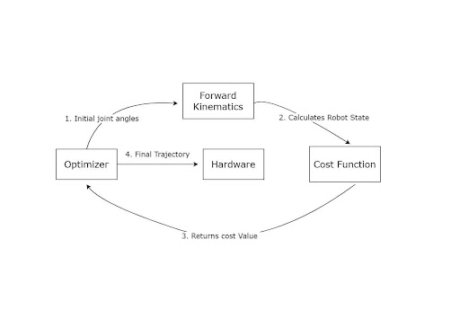

# Biped Control

A C++ ROS package for controlling a 6-DOF biped robot capable of dynamic walking.


## Features
- Real-time motor control using Dynamixel servos
- Forward kinematics and balance monitoring
- Real-time visualization
- Walking trajectory generation

## Architecture
The trajectory generation and control pipeline:



## Quick Start
```bash
# Clone the repository
cd ~/catkin_ws/src
git clone https://github.com/yourusername/biped_control.git

# Build
cd ~/catkin_ws
catkin build

# Launch the robot control
roslaunch biped_control biped_complete.launch